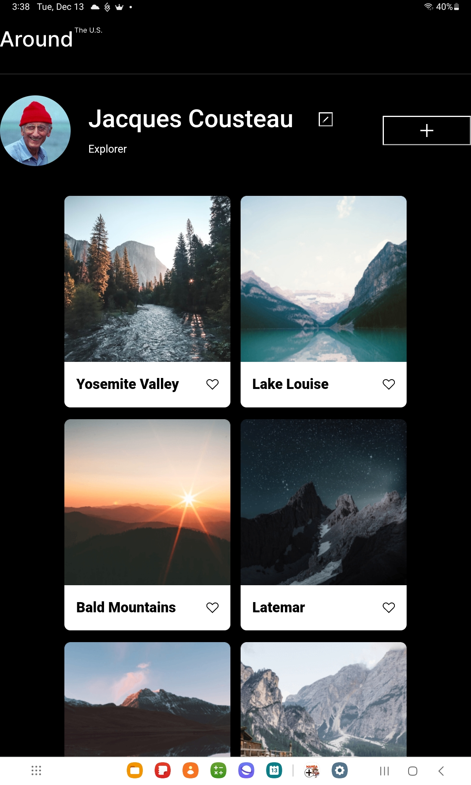

# Project 3: Around The U.S.

### Description

A simple profile page for a user that makes use of HTML, CSS, and Javascript. The page is intended to be responsive.

**Figma**

-[Link to the project on Figma](https://www.figma.com/file/ii4xxsJ0ghevUOcssTlHZv/Sprint-3%3A-Around-the-US?node-id=0%3A1)

**Images**

**Github**

- [Link to the Github Pages page](https://sardonic0087.github.io/se_project_aroundtheus/)
